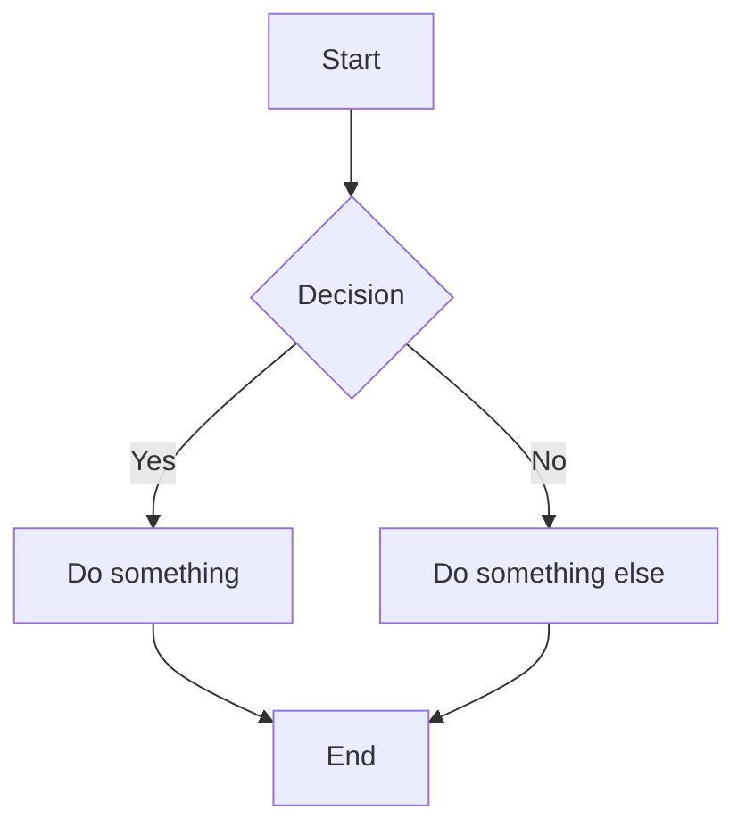
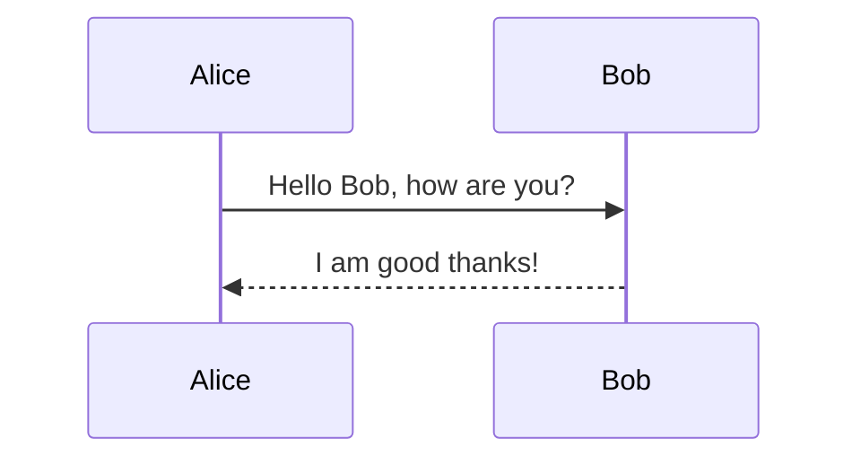

# Mermaid Diagram

Mermaid.js is a JavaScript library for creating diagrams and flowcharts
directly in the browser, using a concise, Markdown-inspired text syntax —
a browser-native alternative to [[plantuml-diagram]]'s
Java-based renderer, with especially strong support for embedding
directly inside Markdown documents.

## Diagram types

Flowcharts, sequence diagrams, Gantt charts, class diagrams, state
diagrams, pie charts, and more — covering much of the same diagram-type
territory as [[plantuml-diagram]] (see
[[activity-diagram]], [[sequence-diagram]],
[[class-diagram]], [[state-diagram]] and this collection's
other diagram-type skills for the underlying UML modeling concepts,
independent of which text-based tool renders them).

## Example syntax





The syntax reads close to plain English/Markdown — deliberately more
approachable to non-technical readers than PlantUML's somewhat denser
notation, which is part of why Mermaid has become the default choice for
diagrams embedded directly in Markdown documentation.

## Key characteristics

- **Markdown-like syntax** — concise and human-readable, approachable
  even for non-technical contributors editing documentation.
- **Browser-based** — runs entirely client-side with no server-side
  processing or external service dependency, making it easy to embed
  diagrams directly on a webpage.
- **Live rendering** — diagrams render in real time as the specification
  is written or edited, giving immediate visual feedback.
- **Customization** — colors, fonts, arrow styles, line thickness, and
  other visual attributes are all configurable.
- **Broad integration** — works in Markdown editors, CMSs, documentation
  tools, and general web applications; supports exporting to SVG or PNG.

## Where Mermaid renders natively

Mermaid is supported directly (no extra library needed) in GitHub and
GitLab Markdown (fenced ` ```mermaid ` code blocks), and in this
environment's own Artifacts (both Markdown ` ```mermaid ` fences and
inline `<pre class="mermaid">` blocks in HTML) — making it the more
convenient default choice specifically when a diagram needs to live
inside a Markdown file or a web-rendered document, versus
[[plantuml-diagram]], which more commonly needs a rendering step or
plugin to produce an image.

## Mermaid vs. PlantUML

Both are text-based diagram tools with overlapping diagram-type coverage.
Mermaid favors approachability and native Markdown/web rendering;
PlantUML (see [[plantuml-diagram]]) offers a broader diagram-type
catalog (C4 model, ArchiMate, WBS, mind maps, and more) and more
fine-grained styling control at the cost of needing a Java-based renderer
or plugin in most contexts. Choose based on where the diagram needs to
live (embedded in Markdown/web → Mermaid; a broader modeling need, or an
existing PlantUML-based toolchain → PlantUML) rather than assuming one is
strictly better.

## Common pitfalls

- **Assuming full feature parity with PlantUML** — Mermaid's diagram-type
  catalog, while substantial, is narrower than PlantUML's (no native
  ArchiMate or C4-model support, for instance); check current Mermaid
  documentation before assuming a specific PlantUML feature has a direct
  equivalent.
- **Overly dense flowcharts** — Mermaid's approachable syntax makes it
  easy to keep adding nodes; the same overcrowding warning
  [[flowchart]] and [[class-diagram]] give elsewhere applies
  here too.
- **Forgetting the platform needs native Mermaid support** — not every
  Markdown renderer supports Mermaid fences out of the box; verify the
  target platform (or add the JS library) before assuming a `​```mermaid`
  block will render rather than show as a plain code block.

## Learn more

- [Mermaid.js documentation](https://mermaid.js.org/)
- [[plantuml-diagram]] for the alternative text-based diagramming tool with a broader diagram-type catalog.
- [[flowchart]], [[sequence-diagram]], [[class-diagram]], [[state-diagram]] for the underlying diagram-type modeling concepts, independent of rendering tool.
