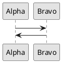

# PlantUML

PlantUML is a text-to-diagram tool: plain-text source between `@start...`/
`@end...` markers compiles to a rendered image, so diagrams live in
version control as readable, diffable text rather than binary drawing
files.

## Core diagram types



That's a **sequence diagram** — PlantUML's most common use. Other core
`@startuml`-based diagrams: **usecase** (`(Story1) --> (Story2)`),
**object** (`object Object1 { Alpha \n Bravo }`), **class**
(`Class1 <|--o Class2` for composition-style relationships), **entity
relationship (ERD)** (`entity Entity1 { ... }` with `}o-down-o{` crow's-foot
style relationships), **component**, **state**
(`[*] --> State1 : Start`), **deployment**, and **timing** diagrams — all
share the same `@startuml ... @enduml` wrapper and a broadly consistent
arrow/relationship syntax.

## Non-UML diagram types

PlantUML extends beyond UML proper, each with its own start/end pair:

```plantuml
@startgantt
[Task1] on {Alice} requires 8 days
then [Task2] on {Bob} requires 4 days and is 50% complete
@endgantt

@startwbs
* Top
** A
*** A1
@endwbs

@startmindmap
+ C
++ D
-- A
@endmindmap

@startjson
{"fruit":"Apple","size":"Large","color":["Red","Green"]}
@endjson

@startsalt
{
  Hello world
  [Button]
  (X) Radio 2
}
@endsalt
```



Respectively: **Gantt charts** (`@startgantt`, with resource assignment
and percent-complete), **work breakdown structures** (`@startwbs`, `*`
depth-nesting like a bulleted outline), **mind maps** (`@startmindmap`,
`+`/`-` for right/left branches), **JSON/YAML data visualization**
(`@startjson`/`@startyaml`, renders the structure as a tree), **wireframes**
(`@startsalt`, ASCII-art-like UI mockup syntax), and **ASCII-art diagrams
via Ditaa** (`@startditaa`).

## Styling

`skinparam monochrome true` is used consistently across simple examples —
useful default for diagrams meant to render legibly regardless of a
document's color scheme or a viewer's light/dark mode, deferring visual
theming to context rather than baking in a fixed palette. `skinparam
defaultTextAlignment center` centers text in shapes.

## Icon libraries

PlantUML bundles **OpenIconic** (`<&heart>` inline glyph syntax, built-in)
and supports **Font Awesome** via
`!include <tupadr3/font-awesome/star>` then `<$star>` inline — useful for
adding recognizable icons into node labels without external image assets.
`listopeniconic` and `listsprite` special diagrams enumerate available
icons/sprites directly, and `stdlib` lists the bundled standard-library
folders.

## Architecture-specific extensions

- **C4 model** (Context, Containers, Components, Code) — via the
  C4-PlantUML library, for layered software-architecture diagrams at
  increasing zoom levels; useful when a single diagram would otherwise try
  to show both a system's external context and its internal component
  detail at once.
- **ArchiMate** — via `!include <archimate/Archimate>`, for enterprise-
  architecture modeling across Motivation, Strategy, Business,
  Application, Technology, Physical, and Implementation layers, with
  dedicated `sprite` icons per element type (`$stakeholder`,
  `$capability`, `$product`, etc.) and `Grouping(...)` for layered
  visual organization.

## Custom procedures

```plantuml
!procedure $demo($name, $headline, $description)
  card $name as "\n<size:22>$headline</size>\n\n<size:12>$description</size>\n"
!endprocedure

$demo(MyCard, "Hello World", "This is a demonstration")
```

`!procedure`/`!endprocedure` defines a reusable, parameterized diagram
snippet — useful for a consistent custom card/node style repeated many
times across one diagram (or across a whole project's diagrams via a
shared included file), rather than hand-repeating the same styled markup.

## Common pitfalls

- **Forgetting the matching `@end...` tag** for whichever `@start...` was
  used — each diagram type has its own paired closing tag
  (`@startuml`/`@enduml`, `@startgantt`/`@endgantt`, etc.), not a single
  universal one.
- **Mixing relationship arrow styles across diagram types** — sequence
  diagram arrows (`->`), class diagram inheritance (`<|--`), and ERD
  crow's-foot notation (`}o-down-o{`) are not interchangeable; each
  diagram type has its own relationship vocabulary.
- **Overloading one diagram with too much detail** — the C4 model's whole
  point is splitting detail across Context/Container/Component/Code
  diagrams rather than one diagram trying to show everything at every
  zoom level at once.
- **Not version-controlling the `.plantuml` source alongside the
  rendered image** — the entire benefit of a text-based diagram tool is
  lost if only the rendered PNG is committed and the source is
  regenerated ad hoc or lost.

## Learn more

- [joelparkerhenderson/plantuml-examples](https://github.com/joelparkerhenderson/plantuml-examples) — the source for this skill, with rendered images alongside every source snippet above.
- [PlantUML official site](https://plantuml.com/) — full language reference.
- [C4-PlantUML](https://github.com/plantuml-stdlib/C4-PlantUML/)
